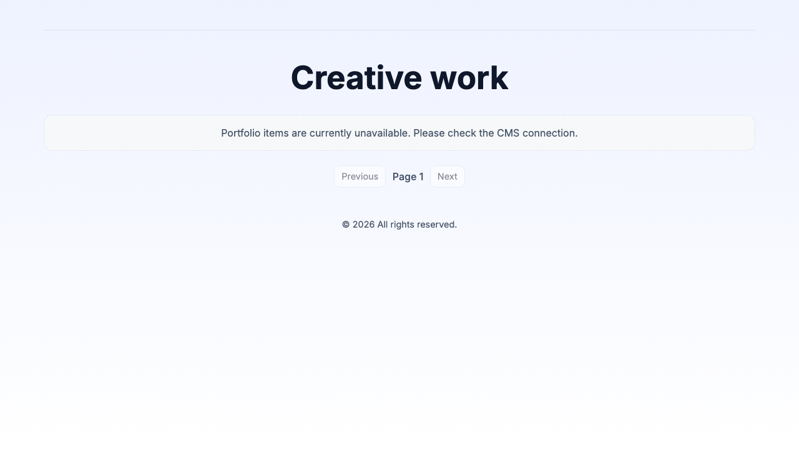

# Headless WordPress Portfolio


**Live:** [elli-wordpress-portfolio.vercel.app](https://elli-wordpress-portfolio.vercel.app)

Capace internship portfolio (Malmö, Nov 2023 – Feb 2024), modernized in 2026 — same visual identity, stable deploy, interview-ready case studies.

## Architecture

```
WordPress (ACF + WPGraphQL)  ──GraphQL──►  Next.js 14 (App Router)
     AwardSpace CMS                         Vercel frontend
```

| Layer | Role |
|--------|------|
| **WordPress** | Home hero, About/Contact when pages exist |
| **Next.js** | UI, topic pills, case studies at `/work/[slug]` |
| **`portfolio-cms.php`** | GraphQL compatibility for legacy queries |
| **`src/data/projects.ts`** | Deployed projects + interview copy |

## Interview walkthrough (≈3 min)

1. Homepage → filter with **topic pills** → open a case study.
2. Read **60-second pitch** → **outcome** → **what I learned**.
3. Open **live project** only after context (shows product thinking).
4. Flagship projects: **Headless Portfolio**, **Pokémon Search**, **Advokatbyrå Site**.

## Working with AI (transparent)

Parts of the 2026 refresh used AI-assisted tooling for speed (refactors, copy drafts, deploy fixes).  
All changes were **reviewed, run locally, and verified** before shipping — the architecture and tradeoffs are mine to explain in an interview.

## Features

- Case study flow before external live links
- Headless CMS content where configured
- Graceful fallbacks when CMS pages are missing
- Responsive card layout + topic filtering

## Screenshots

### Home page


## Local development

```bash
npm install
cp .env.local.example .env.local   # set wordpressApiKey
npm run dev
```

Open [http://localhost:3000](http://localhost:3000)

## Environment variables

```bash
wordpressApiKey=https://your-wordpress-site/graphql
NEXT_PUBLIC_DEPLOY_URL=https://elli-wordpress-portfolio.vercel.app
```

## Main routes

| Route | Purpose |
|--------|---------|
| `/` | Portfolio grid + category pills |
| `/work/[slug]` | Case study |
| `/about` | About (CMS or fallback) |
| `/contact` | Contact (CMS or fallback) |
| `/projects/[slug]` | WordPress post detail |

## Key files

- `src/data/projects.ts` — project copy and deploy URLs
- `src/lib/fallback-content.ts` — About/Contact/Home fallbacks
- `src/lib/wp.ts` — GraphQL client
- `wordpress/mu-plugins/portfolio-cms.php` — CMS compatibility

## Original repos (Nov 2023)

- [frontend-application](https://github.com/Elli2022/frontend-application)
- [typescript-app-template](https://github.com/Elli2022/typescript-app-template)
- [nextjs-auth-blog-modernized](https://github.com/Elli2022/nextjs-auth-blog-modernized)
- [fullstack-application](https://github.com/Elli2022/fullstack-application)
- [wordpress-portfolio](https://github.com/Elli2022/wordpress-portfolio)

## CMS setup

See `wordpress/README.md` and `wordpress/HOSTING_GRATIS.md`.
