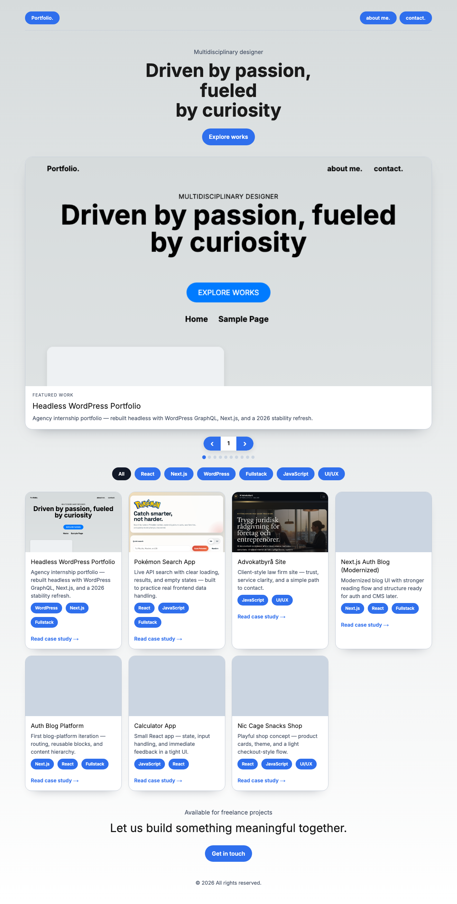
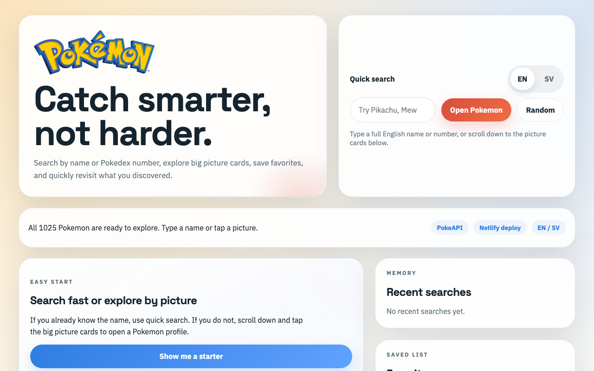
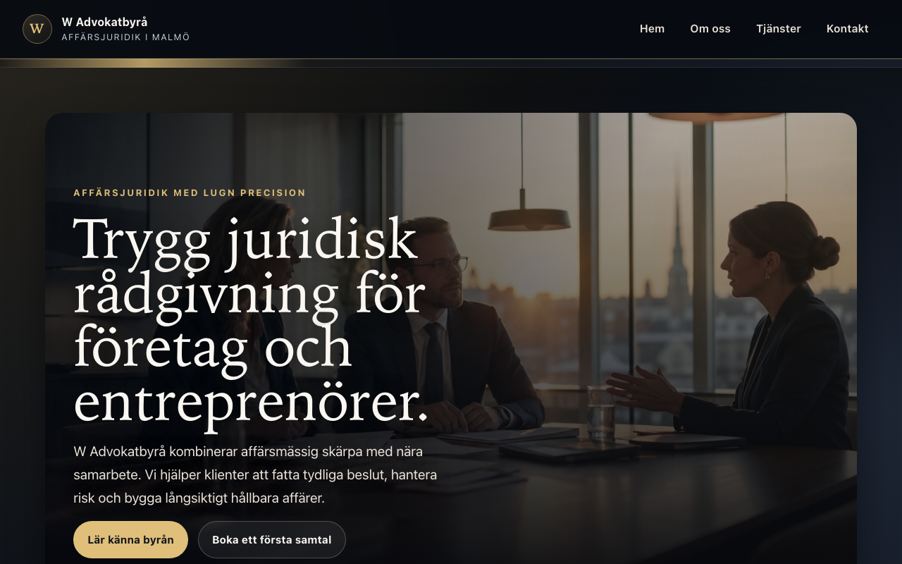

# Headless WordPress Portfolio

**Live demo:** [elli-wordpress-portfolio.vercel.app](https://elli-wordpress-portfolio.vercel.app) · **Repo:** [github.com/Elli2022/wordpress-portfolio](https://github.com/Elli2022/wordpress-portfolio)


A production-ready **headless portfolio**: WordPress (content) + Next.js 14 (experience). Built during an internship at **Capace Media Group AB** (Malmö, 2023–2024), modernized in 2026 for stable deploy, recruiter-friendly case studies, and transparent AI-assisted workflow.

---

## Why recruiters should open this

| What you will see | Why it matters |
|-------------------|----------------|
| **Split CMS + frontend** | Real headless pattern — not a WordPress theme with a skin |
| **Case study first** | Topic filters → pitch / outcome / learnings → *then* live demo + GitHub |
| **7 shipped projects** | Clear progression: APIs, agency UI, auth/blog evolution, focused demos |
| **Production habits** | CMS fallbacks, screenshot pipeline, resilient images, typed GraphQL layer |
| **Honest About page** | How AI is used as a tool — architecture and review stay human-owned |

**Best for:** junior / internship / first frontend roles where you want evidence of React, Next.js, and CMS integration thinking.

---

## Quick start (2 minutes)

1. Open the [live site](https://elli-wordpress-portfolio.vercel.app/)
2. Use **topic pills** (React, Next.js, WordPress, …) and the **project gallery**
3. Open a case study — e.g. [Headless Portfolio](https://elli-wordpress-portfolio.vercel.app/work/wordpress-portfolio-headless) or [Pokémon Search](https://elli-wordpress-portfolio.vercel.app/work/pokemon-search-app)
4. Read the **60-second pitch**, then **View live project**

**Flagship walkthrough (~3 min):** Home → filter → case study → explain WordPress ↔ GraphQL ↔ Vercel + AwardSpace CMS.

---

## About the developer

**Eleonora Nocentini Sköldebrink** · Junior developer · Malmö, Sweden

I build clear, minimal interfaces — from agency-style internship prototypes at **Capace** to production-minded headless setups with React, Next.js, and WordPress GraphQL.

The internship (Nov 2023 – Feb 2024) covered client-near layouts, API-driven apps, and this portfolio. In 2026 I refreshed the codebase for reliable Vercel deploys — using AI for boilerplate and docs, with every change reviewed and run locally before shipping.

**Contact:** [eleonora.nocentini@gmail.com](mailto:eleonora.nocentini@gmail.com) · [GitHub](https://github.com/Elli2022) · [About](https://elli-wordpress-portfolio.vercel.app/about) · [Contact](https://elli-wordpress-portfolio.vercel.app/contact)

---

## Architecture

```
WordPress (ACF + WPGraphQL)  ──GraphQL──►  Next.js 14 (App Router)
     AwardSpace CMS                         Vercel (frontend)
```

| Layer | Role |
|--------|------|
| **WordPress** | Home hero, About/Contact when pages exist in CMS |
| **Next.js** | UI, topic pills, horizontal gallery, case studies at `/work/[slug]` |
| **`portfolio-cms.php`** | GraphQL compatibility for legacy ACF fields |
| **`src/data/projects.ts`** | Project copy, deploy URLs, interview narrative |
| **`src/lib/fallback-content.ts`** | About/Contact/Home when CMS pages are missing |

**Visitor flow:** Home (filter / gallery / grid) → `/work/[slug]` case study → live demo + GitHub.

More detail: [ARCHITECTURE.md](./ARCHITECTURE.md) · [docs/CODEBASE.md](./docs/CODEBASE.md)

---

## Featured projects

| Project | Live | Case study |
|---------|------|------------|
| **Headless Portfolio** (this app) | [Vercel](https://elli-wordpress-portfolio.vercel.app) | [/work/wordpress-portfolio-headless](https://elli-wordpress-portfolio.vercel.app/work/wordpress-portfolio-headless) |
| Pokémon Search App | [Netlify](https://pokemon-search-application.netlify.app) | [/work/pokemon-search-app](https://elli-wordpress-portfolio.vercel.app/work/pokemon-search-app) |
| Law Firm Site (Advokatbyrå) | [Netlify](https://w-advokatbyra-malmo.netlify.app) | [/work/advokatbyra-site](https://elli-wordpress-portfolio.vercel.app/work/advokatbyra-site) |
| Next.js Auth Blog (modern) | [Netlify](https://my-nextjs-project-modernized.netlify.app) | [/work/nextjs-auth-blog-modernized](https://elli-wordpress-portfolio.vercel.app/work/nextjs-auth-blog-modernized) |
| Auth Blog Platform | [Netlify](https://auth-blog-platform.netlify.app) | [/work/auth-blog-platform](https://elli-wordpress-portfolio.vercel.app/work/auth-blog-platform) |
| Calculator App | [Netlify](https://calculator-app-elli2022.netlify.app) | [/work/calculator-app](https://elli-wordpress-portfolio.vercel.app/work/calculator-app) |
| Nic Cage Snacks Shop | [Netlify](https://nic-cage-snacks.netlify.app) | [/work/nic-cage-snacks-shop](https://elli-wordpress-portfolio.vercel.app/work/nic-cage-snacks-shop) |

**Interview priorities:** (1) Headless Portfolio — architecture, (2) Pokémon Search — API & UX states, (3) Law Firm Site — trust & hierarchy.

---

## Production checklist

| Check | Status |
|-------|--------|
| Live on Vercel | ✅ [elli-wordpress-portfolio.vercel.app](https://elli-wordpress-portfolio.vercel.app) |
| Home, About, Contact | ✅ |
| Case studies `/work/[slug]` | ✅ 7 projects |
| WordPress GraphQL | ✅ [elliportfolio.atwebpages.com/graphql](http://elliportfolio.atwebpages.com/graphql) |
| `npm run build` | ✅ |

**Known tradeoffs (fine to mention in interviews):** About/Contact often use **code fallbacks** when WP pages are empty; other demos stay on **Netlify** as separate internship repos; LinkedIn not linked by choice.

---

## Screenshots







All projects: `public/screenshots/projects/[slug]/` (`desktop.png`, `mobile.png`, `thumb.png`). Refresh after URL changes:

```bash
npm run screenshots
```

---

## Local development

```bash
git clone https://github.com/Elli2022/wordpress-portfolio.git
cd wordpress-portfolio
npm install
cp .env.local.example .env.local   # set wordpressApiKey
npm run dev
```

Open [http://localhost:3000](http://localhost:3000). Production-like run: `npm run build && npm run start`.

**Environment variables**

```bash
wordpressApiKey=http://elliportfolio.atwebpages.com/graphql
NEXT_PUBLIC_DEPLOY_URL=https://elli-wordpress-portfolio.vercel.app
```

| Variable | Purpose |
|----------|---------|
| `wordpressApiKey` | WordPress GraphQL endpoint |
| `NEXT_PUBLIC_DEPLOY_URL` | Base URL for previews / metadata |

---

## Routes

| Route | Purpose |
|--------|---------|
| `/` | Gallery, topic pills, project grid |
| `/work/[slug]` | Case study (pitch, outcome, screenshots, live + GitHub) |
| `/about` | About (CMS or fallback) |
| `/contact` | Contact (CMS or fallback) |
| `/projects/[slug]` | WordPress post (e.g. `hello-world`) |
| `/all` | Legacy contact path |

---

## Key files

| File | Contents |
|------|----------|
| `src/data/projects.ts` | Projects, deploy URLs, case study copy |
| `src/lib/fallback-content.ts` | About, Contact, Home fallbacks |
| `src/lib/wp.ts` | GraphQL client |
| `src/app/components/ProjectShowcase.tsx` | Gallery, filter, grid on home |
| `wordpress/mu-plugins/portfolio-cms.php` | CMS GraphQL compatibility |
| `legacy/my-headless-wordpress-portfolio-2023/` | Full 2023 internship codebase snapshot |

---

## Documentation

| Document | Contents |
|----------|----------|
| [docs/CODEBASE.md](./docs/CODEBASE.md) | Components, pages, GraphQL helpers, 2023→2026 mapping |
| [docs/HISTORY.md](./docs/HISTORY.md) | Timeline and preserved artifacts |
| [legacy/](./legacy/) | Imported 2023 source tree |
| [wordpress/README.md](./wordpress/README.md) | Local Docker CMS setup |
| [wordpress/HOSTING.md](./wordpress/HOSTING.md) | Free WordPress.org hosting for GraphQL |

---

## Deploy

| Platform | URL |
|----------|-----|
| **Vercel** (production) | https://elli-wordpress-portfolio.vercel.app |
| **Netlify** | Separate repos for internship demos (see table above) |

Deploy from `main` via Vercel Git integration. Set `wordpressApiKey` in Vercel environment variables.

---

## Related repositories

| Repo | Role |
|------|------|
| **wordpress-portfolio** (this) | Canonical — code, deploy, docs |
| [My-Headless-Wordpress-Portfolio](https://github.com/Elli2022/My-Headless-Wordpress-Portfolio) | 2023 snapshot (also in `legacy/`) |
| [frontend-application](https://github.com/Elli2022/frontend-application) | Earlier internship frontend |
| [typescript-app-template](https://github.com/Elli2022/typescript-app-template) | Course template |
| [fullstack-application](https://github.com/Elli2022/fullstack-application) | Fullstack practice |

---

## License & use

Portfolio for hiring, internships, and demos. Email above for a live walkthrough or code questions.
